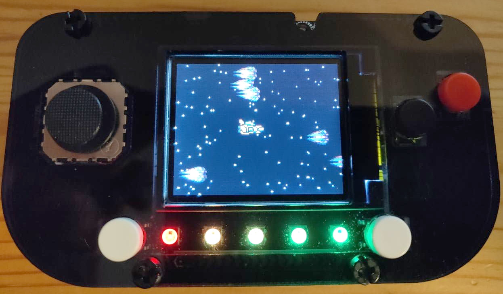

# xship

A shoot'em up built with [tinygo](https://tinygo.org/) for the [pygamer](https://www.adafruit.com/product/4242)



*Maybe a good template to learn tinygo with microcontrollers*.

## Installation (Linux)

Install tinygo >= 0.22.0.

Connect your pygamer to a USB port.

```bash
git clone git@github.com:jypelle/xship.git
cd xship
go get -u tinygo.org/x/drivers
make install
```

Enjoy!

### Installation with new game asset

If you have updated [game asset](images/asset.png):

Install go >= 1.17

```bash
make asset
make install
```
